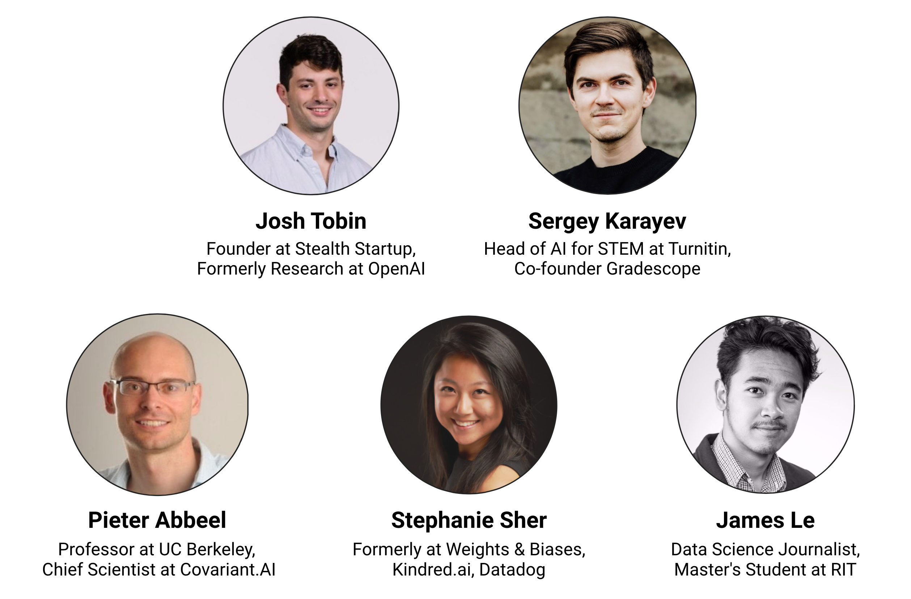
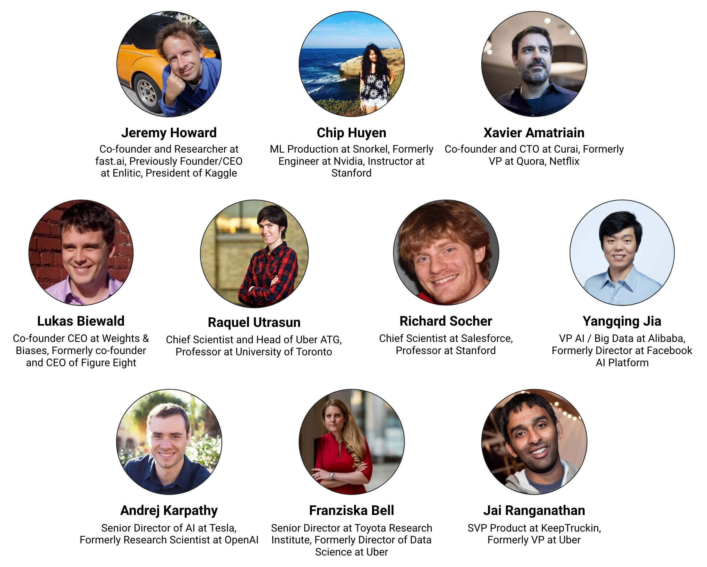

# Full Stack Deep Learning

## About this course

Since 2012, deep learning has lead to remarkable progress across a variety of challenging computing tasks, from image recognition to speech recognition, robotics, and audio synthesis. Deep learning has the potential to enable a new set of previously infeasible technologies like autonomous vehicles, real-time translation, and voice assistants and help reinvent existing software categories.

There are many great courses to learn how to train deep neural networks. However, training the model is just one part of shipping a deep learning project. This course teaches **full-stack production deep learning:**

*  Formulating the **problem** and estimating project **cost**
*  Finding, cleaning, labeling, and augmenting **data**
*  Picking the right **framework** and compute **infrastructure**
*  **Troubleshooting** training and ensuring **reproducibility**
*  **Deploying** the model at scale

This course was originally taught as an in-person boot camp in Berkeley from 2018 - 2019. It was also taught as a University of Washington Computer Science [PMP course](https://bit.ly/uwfsdl) in Spring 2020.

The discussion page for the course on [Gitter](https://gitter.im/full-stack-deep-learning/fsdl-course).

The course project is on [Github](https://github.com/full-stack-deep-learning/fsdl-text-recognizer-project).


Please [submit a pull request](https://github.com/full-stack-deep-learning/course-gitbook) if any information is out of date or if you have good additional info to add!


## Who is this for

The course is aimed at people who already know the basics of deep learning and want to understand the rest of the process of creating production deep learning systems. You will get the most out of this course if you have:

* At least one-year experience programming in Python.
* At least one deep learning course \(at a university or online\).
* Experience with code versioning, Unix environments, and software engineering.

We will not review the fundamentals of deep learning \(gradient descent, backpropagation, convolutional neural networks, recurrent neural networks, etc\), so you should review those materials first if you are rusty.

## Organizers

## Guest Lectures

## Newsletter



## Course Content















## Guest Lectures





















